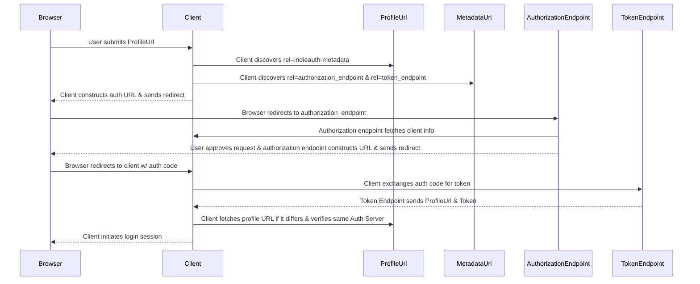

# IndieAuth Client

[`sequence`](https://macchiato.dev/diagram)




[`js`](https://macchiato.dev/sandbox)

```js
(async () => {
  const delay = t => new Promise(r => setTimeout(r, t))
  for (let i=0; i < 100; i++) {
    if (document.querySelector('svg') && document.querySelector('#output')) {
      break
    }
    await delay(10)
  }
  const outputEl = document.querySelector('#output')
  const introText = 'Hover over the actions to view the text here. Click to open the relevant page.'
  outputEl.innerText = introText
  for (const el of document.querySelectorAll('text')) {
    el.addEventListener('mouseenter', () => {
      el.style.fill = 'yellow'
      el.style.cursor = 'pointer'
      outputEl.innerText = el.textContent
    })
    el.addEventListener('mouseleave', () => {
      el.style.fill = ''
      outputEl.innerText = introText
    })
    el.addEventListener('click', () => {
      if (/ProfileUrl/.test(el.textContent)) {
        notebookClient.navigate('submit-profile-url.md')
      }
    })
  }
})()
```

[`html`](https://macchiato.dev/sandbox)

```html
<div id="output" style="padding: 5px;">
  
</div>
```

[`css`](https://macchiato.dev/sandbox)

```css
svg .messageText {
  fill: #000;
  stroke: #000;
}
```