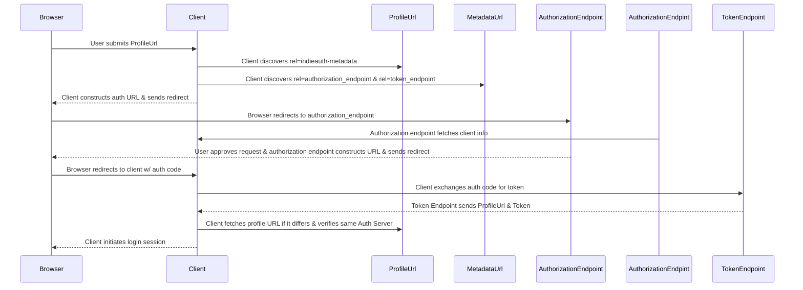

# IndieAuth Client

[`sequence`](https://macchiato.dev/diagram)

```mermaid
sequenceDiagram
    Browser->>Client: User submits ProfileUrl
    Client->>ProfileUrl: Client discovers rel=indieauth-metadata
    Client->>MetadataUrl: Client discovers rel=authorization_endpoint & rel=token_endpoint
    Client-->>Browser: Client constructs auth URL & sends redirect
    Browser->>AuthorizationEndpoint: Browser redirects to authorization_endpoint
    AuthorizationEndpint->>Client: Authorization endpoint fetches client info
    AuthorizationEndpoint-->>Browser: User approves request & authorization endpoint constructs URL & sends redirect
    Browser->>Client: Browser redirects to client w/ auth code
    Client->>TokenEndpoint: Client exchanges auth code for token
    TokenEndpoint-->>Client: Token Endpoint sends ProfileUrl & Token
    Client->>ProfileUrl: Client fetches profile URL if it differs & verifies same Auth Server
    Client-->>Browser: Client initiates login session
```